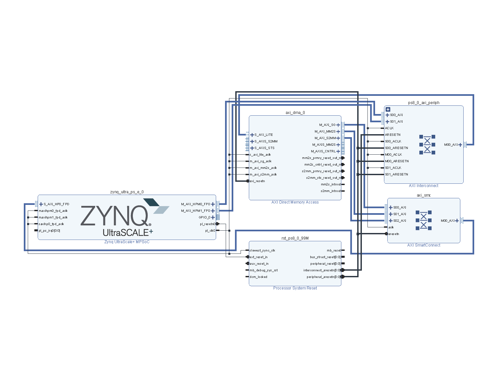
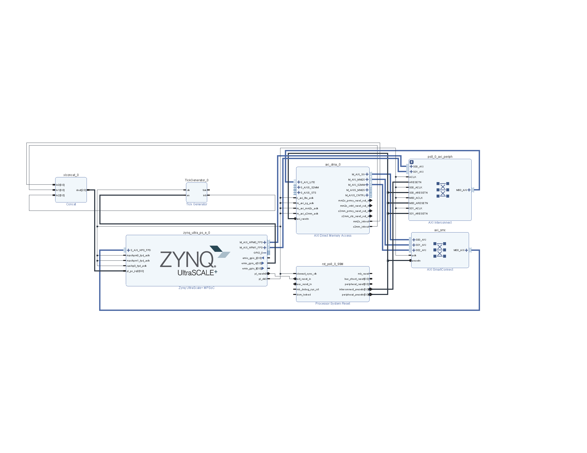
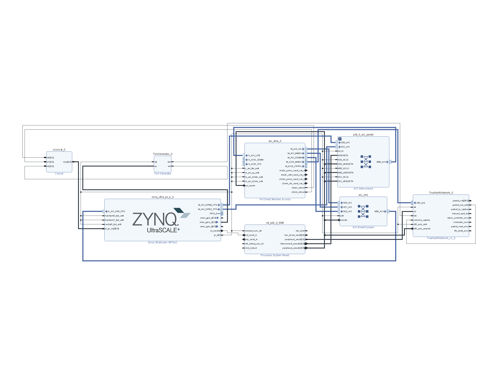
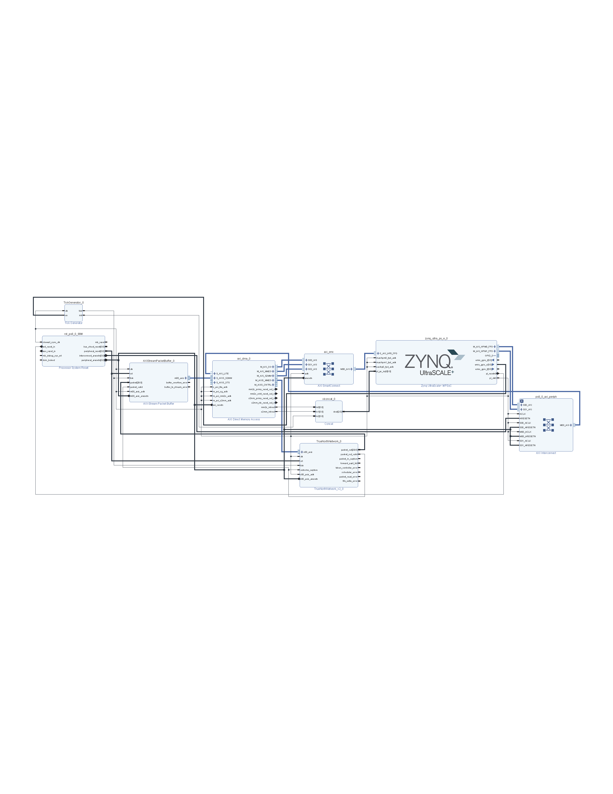

# Streaming Tutorial

This tutorial outlines how to set up a streaming environment to stream data in and out of the RANC emulation. A completed version of the project generated in this tutorial can be found [here](FIXME).

We'll go over the basics of how to setup both the hardware and software environments and use a simple neural network trained on the MNIST dataset to make sure that everything is working properly.

In order to stream data, we need a development board with an FPGA and at least two arm cores. This tutorial targeting the ZYNQ Ultra-Scale MPSOC.

## Hardware

We'll begin with the hardware environment. This tutorial is using Xilinx Vivado 2018.2, so there may be a few discrepencies with an older/newer version. If you would like to use a tool other than Vivado, hopefully this tutorial will at least illuminate how the different components using for streaming interact.

### IP

First we need to make sure we have all the IP necessary for the project. It's easiest if you create a folder to contain all the RANC IP, which I'll refer to as `$IP_ROOT$`. We'll need the following repositories:

- [rancnetwork](FIXME): This is the actual RANC emulation.
- [tickgenerator](FIXME): This is a simple clock-divider-like module which generates the tick signal for RANC as well as an interrupt for the software.
- [axistreampacketbuffer](FIXME): This buffers packets coming out of RANC and converts them into an AXIStream to send back to the CPU.

Clone all these repositories into `$IP_ROOT$` and then continue to the next step.

### Creating the project

Now that we have the IP in place, we can create the project. Open Vivado and create a new RTL Project. Target the `Zynq UltraScale+ ZCU1-2 Evaluation Board`. Once the project is created, click on `Create Block Design` under the `IP Integrator`.

#### MPSoC

The first thing we'll add is the `Zynq UltraScale+ MPSoC` IP. This provides us with all the necessary IO from the ARM cores to the programmable logic. Click on the `+` button to add IP and search for "zynq". The `Zynq UltraScale+ MPSoC` IP should come up. Click on it to add it to the project. Once it's added, an automation notification should appear. Follow the steps on that window to perform the preliminary IP automation.

Next, double click on the IP block. We need to add two things: EMIO GPIO to send an enable signal out from the ARM cores, and a high performance AXI slave port. 

For the EMIO GPIO, navitage to the `I/O Configuration` -> `Low Speed` -> `I/O Peripherals` tab and check the GPIO EMIO box. We only need 1 bit, so in the I/O column select the dropdown box and scroll down to and select 1.

For the slave port, navitage to the `PS-PL Configuration` -> `Slave Interface` -> `AXI HP` tab and check the `AXI HP0 FPD` box. That's all the configuration we need for this IP. Click okay and finish.

#### DMA

Next we need to setup the DMA engine. This is what we'll use to transfor data from the ARM core to the PL. Now add the `AXI Direct Memory Access IP`. Once it's added, there should be connection automation available. Run all the available automation. This should add a few more blocks and some wires. At this point, your block design should look something like this:

Double click on the DMA IP block and uncheck the `Enable Scatter Gather Engine` box and click okay.

We need to make sure that the interrupts from DMA engine are going back to the processor. For this, we'll need to concatenate the two interrupts from the DMA, `mm2s_introut` and `s2mm_introut` to send to the `pl_ps_irq0` port on the ultrascale. We'll actually need a third interrupt later, so we'll need the space to concatenate three one-bit wires. Add the `Concat` IP to your block design. Double click on the IP and set the number of ports to 3 and then press okay. Send the output of the concat to the `pl_ps_irq0` port on the ultrascale, and send the two aformentioned interrupts from the DMA to the top two ports on the concat.

#### Tick Generator

Before we add the RANC IP, we need to make sure that it has a tick signal available. For this, we'll use the custom tick generator IP. First, we need to make sure that Vivado knows where our custom IP is. Click on the `IP Catalog` option under the `Project Manager`. Then, right click on some of the white space within the catalog and click on `Add Repository...`. Then, navigate to the `$IP_ROOT` folder we created earlier and add that repostiory. It should pop up with a window showing that it added the IP from that folder.

Navigate back to the block design and add the `Tick Generator` IP. You can run the connection automation to attatch the clock to the IP. Double clik on the IP to edit it. The default clock frequency from the ultrascale is 100 MHz, which should be default in the tick generator as well. However, we're going to slow the tick frequency down to 1 Hz to make sure we won't run into any timing issues. For our purposes, this means we'll be classifying images at a speed of 1 image per second.

The `en` signal for the tick generator is going to come from the `emio_gpio_o` port we added to the ultrascale earlier. This will allow the ARM core to tell the tick generator when to start generating the tick, and thus when to begin classification. The `intr` port from the tick generator will be the other wire to go into the concat IP we added earlier, so that the ARM core can know when a tick occured.

At this point, the block diagram should look something like this:

#### RANC

Now we're ready to add the RANC IP. We can run the connection automation to attatch the clock and reset signals. The `tick` will come from the Tick Generator IP `tick` port we just added. The `s00_axis` port should be attatched to the `M_AXIS_MM2S` port on the AXI DMA IP. After that is connected, run connection automation again to attach the axi clock and reset signals. For our purposes, `packet_out_valid` can just be looped back around into `outcome_capture`.

At this point, the block diagram should look something like this:

Before we move on, we need to set the RANC parameters correctly. The network we have has 5 cores arranged horizontally in one row. We're interested in the spikes from the last core, which zero indexed is core (4, 0). For this purpose, the grid parameters should be set to `Grid Dimension X = 5`, `Gird Dimension Y = 1`, `Output Core X Coordinate = 4` and `Output Core Y Coordinate = 0`. 

The only parameter that cannot be kept at its default value is the `Memory Filepath` under `Memory Parameters`. This should point to the `data` directory that is a part of this repository. The path must be absolute, use forward slashes, and must end with a forward slash.

#### AXI Stream Packet Buffer

Now we're ready to add the final IP, the `AXIStreamPacketBuffer`, which will buffer the packets that come out of RANC and send them back to the ARM core in a stream.

Add the IP, and run the connection automation to connect the clock and reset. The `tick` comes from the Tick Generator `tick`, `packet` comes from the `packet_out` of RANC, `packet_valid` comes from `packet_out_valid` from RANC, and the `m00_axis` port connects tothe `S_AXIS_S2MM` port on the AXI DMA IP. After this is connected, run the automation to connect the AXI clock and reset.

That's everything we need for the hardware! The final block design should look something like this:

### Exporting the hardware

Now that the block design is down, right click on the `streaming.bd` file in the Sources tab and click on `Create HDL Wrapper`. Let Vivado manage the updates. Once this is created, generate the bitstream. This could take a while.

Once the bitstream is done, we need to export the hardware for the SDK. This can be done with `File->Export->Export Hardware...`. Make sure to check the box to include the bitstream.

Then, go to `File->Launch SDK` to launch the Xilinx SDK.

## Software

To get started, we're going to create a new Application Project (`File->New->Application Project`). We'll start with the project for transmitting into the PL, though we'll need to creat another project for receiving later. Give the project a name (I used `streamingtx`), hit next, and select `Empty Application`. Then hit Finish.

In the project explorer, navigate to `streaming->src`. In the repository for this project, you'll find two c files under the `support_files` folder, `streamingrx.c` and `streamingtx.c`. These are the two files that handle stremaing into and out of the PL. For this project, we'll need `streamingrx.c`. Create a new file called `streamingrx.c` and copy the context of the `streamingrx.c` in this repository into that file.

Next, create a project called `streamingtx` and and `streamingtx.c` to that project. When creating this project, we want it to run on the second ARM core, so under the `Processor` dropdown in the Application Project wizard choose `psu_cortexa53_1`.

Each of these projects will have also added Board Support Packages (BSPs) to the project. These contain the header files that can be used to interface with things like the DMA. For `streamingtx`, we will need the ability to interface with the SD card as well because this will contain the MNIST dataset. This is not included by default in the BSP, so we must add it. Do this by expanding `streamingtx_bsp` in the project explorer and opening `system.mss`. Then clic on `Modify this BSP's Settings` and check the box named `xilffs` and hit ok. Then click `Re-generate BSP Sources` so that the header files get added to the project. This should remove any errors that appeared in `streamingtx.c`.

We also need to make sure that the two applications are using seperate memory regions. This can be done by modifying the `lscript.ld` for each application. Open the `lscript.ld` for the `streamingrx` project and change the Size of the `psu_ddr_0_MEM_0` to `0x3FF80000`. Next, open the `ldsscript.ld` for `streamingtx`. Change the Base Address for `psu_ddr_0_MEM_0` to `0x3FF80004` and change the size to `0x3FF80000`.

With that out of the way, we're ready to begin streaming. First, we need an SD card with the MNIST dataset. Once you have a blank SD card inserted into your computer, copy the `count.bin` and `data.bin` files from the `data` folder in this repository onto the SD card. These files contain the number of packets per image and the packets for each image for the MNIST datset. Put this SD card into the UltraScale and power it on.

Before we run the program, let's attatch to the SDK Terminal in the SDK so we can see what the FPGA sends back to us. Navigate to the SDK Terminal section in the SDK, click the green `+`, and add the COM Port that the FPGA is attatched to. The default baud rate and settings should be fine.

Now, we need to create a run configuration. Navigate to `Run->Run Configurations...` and duoble click on `Xilinx C/C++ Application (System Debugger)`. Make sure `Reset entire system`, `Program FPGA`, `Run psu_init`, and `PL Powerup` are all checked. Move to the Application tab. The first core (`psu_cortexa53_0`) should have `streamingrx` ad the project. The second (`psu_cortexa53_1`) should have `streamingtx`.

Finally, run this configuration. You should see which neurons spike for each tick being printed onto the SDK Terminal. 

`FIXME: Add text file to compare to ticks from simulator.` 