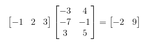
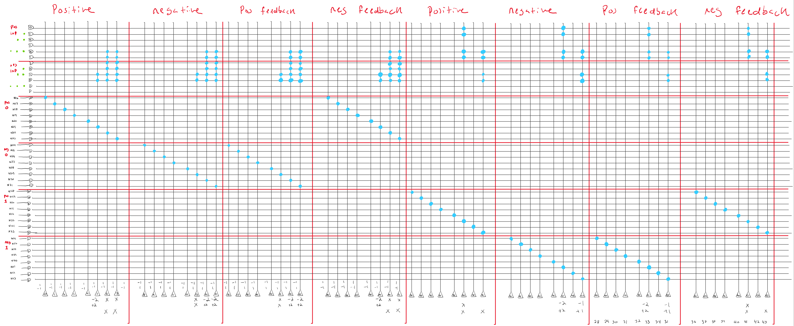
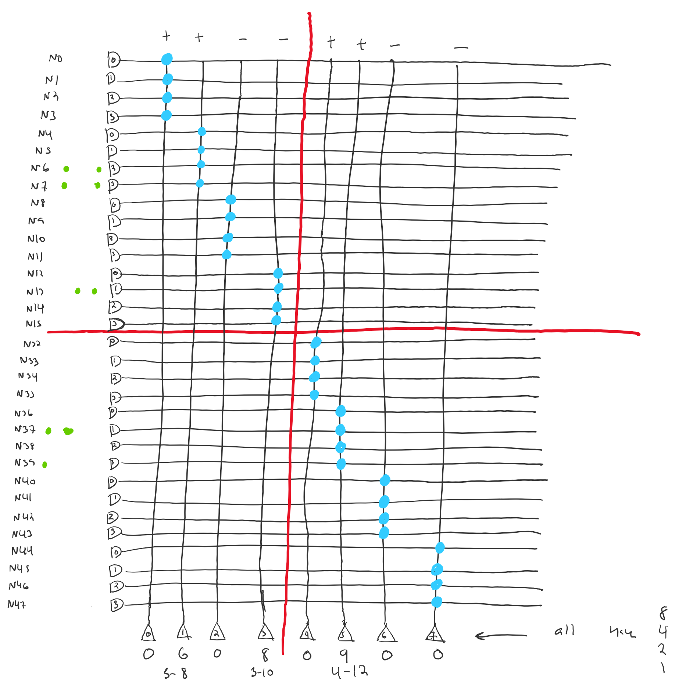
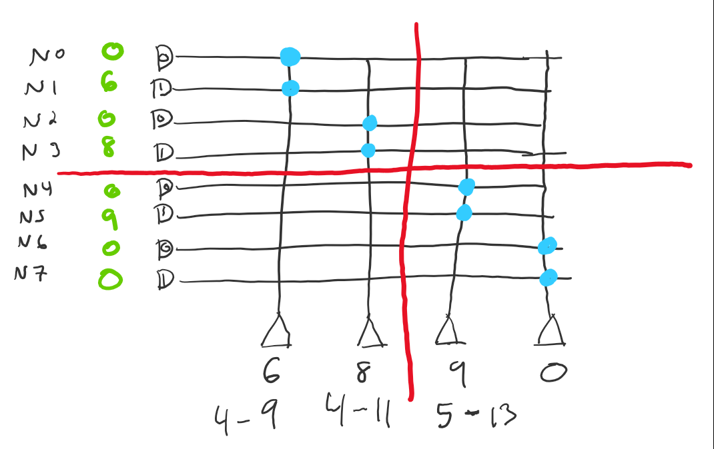
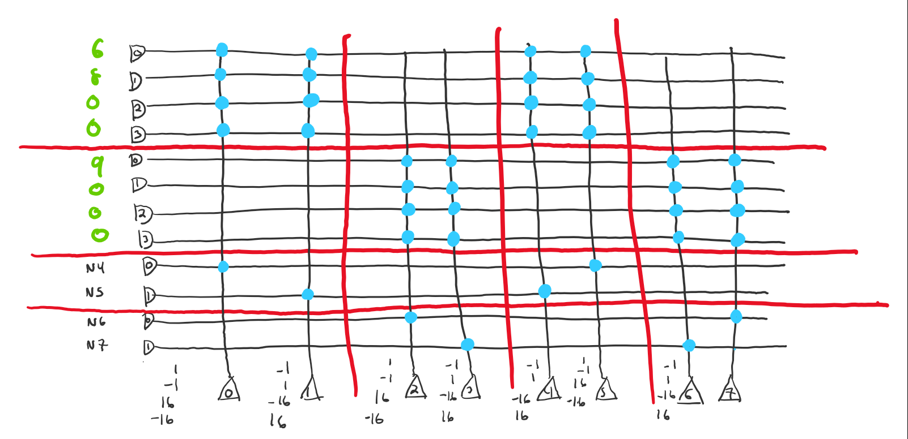
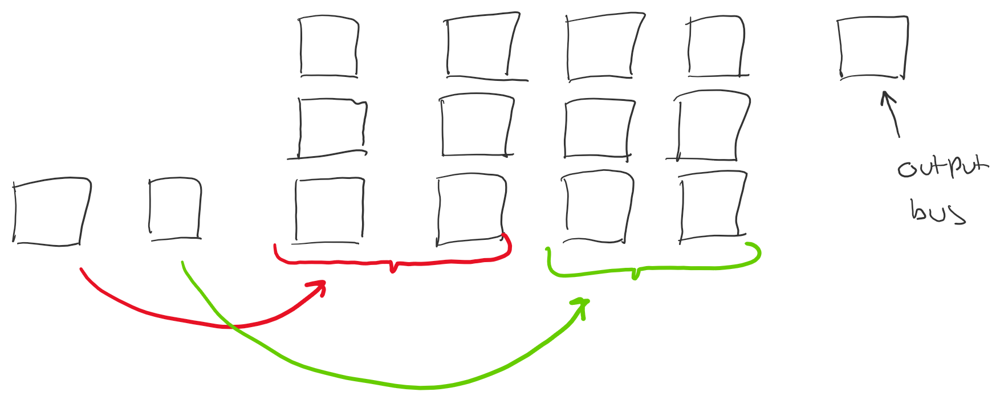

# VMM Map

This package contains functions for mapping vector-matrix multiplication (VMM) corelets to RANC cores.  There are two supported mapping methodologies which can be found in [Daniel Mendat's dissertation](https://jscholarship.library.jhu.edu/handle/1774.2/58684) and [Kaitlin Fair's dissertation](https://smartech.gatech.edu/handle/1853/59782). These two mapping methods 
can be found in this package as `fair_vmm_conversion.py` and `mendat_vmm_conversion.py`. The main focus of developing this has been put into Kaitlin Fair's method as
it provides more precision and allows for negative outputs. Therefore, the implementation of Daniel Mendat's mapping procedure is a little out of date but I am hoping to make a 
constant interface for both of them.
Kaitlin Fair's implementation is a little confusing (especially when looking at the source code to automatically create it) so I have provided a simple VMM and what each core 
should look like to hopefully answer any questions about the source code.

Will show how to implement the following VMM:

Here is a nice description describing Kaitlin's VMM mapping process on TrueNorth:

"Mapping 9-bit signed vector-matrix multiplication requires the use of three "layers" within the TrueNorth architecture. 
The first layer receives the input spikes representative of the vector by which to multiply as a rate code. The matrix 
elements are represented as binary representation numbers using synaptic connections between axons and neurons. The output 
of the first layer is an unsigned binary representation of the output vector. The second layer contains neurons with available 
synaptic weights of {8, 4, 2, 1}, which applies weighting to the binary representation. The third layer then applies an 
additional weighting of {16, 1} to apply significance to the four most- and four least-significant bits, as well as performs 
the summation in order to generate the final output of the VMM operation."

### First Core

For the first core, we need 32 neurons per matrix column. The first set of eight
neurons in a column represent the binary representation of the positive representation of the output element. The second set of eight neurons in 
a column represent the binary representation of the negative representation of the output element in the neuron. The third set of eight neurons 
in a column are the positive feedback neurons which are used to provide feedback to the positive representation neurons. The fourth set of 
eight neurons in a column are the negative feedback neurons which are usd to provide feedback to the negative representation neurons. Refer to Kaitlin
Fair's dissertation for a detailed explanation for the purpose of the feedback neurons.

For this particular example, we are going to need 64 neurons as we have 2 columns in the matrix. This is an image of the first core
for this example:

Note that the first 32 neurons are representing the first column vector in the matrix and the second 32 neurons are representing the second
column vector in the matrix. Note that each element of the input vector is rate coded over two axons. The first axon is the positive representation
of the input and the second axon is the negative representation of the input axon. We have to duplicate the inputs as can be seen in the 7th through
12th axon so we can have the upper set of axons (axons 1 - 6) be multiplied by the positive elements of the matrix and the lower set of axons (axons 7 - 12)
be multiplied by the negative element of the matrix. If we don't do this, the axon indices will get messed up (They won't get messed up if all the values in 
a row of the matrix have the same sign so if that is true for a specific application we can take that out). When looking at the synaptic crossbars, see that the 
first two elements of the first column (-3 and -7) have their binary representation (absolute value) across the lower set of axons, as these numbers are negative.
The third element of the first column (3) has its binary representation across the upper set of axons as it is positive. This is just repeated across all 32 neurons.
It isn't super necessary to understand why the feedback neurons have to be connected as they are, but go to Kaitlin Fair's dissertation for a good description.

### Second Core

The second core is much simpler than the first core. The second core applies a weighting of {8, 4, 2, 1} to the binary representation of both the positive
and negative represention of the output element. In this core, there are four neurons per column in the matrix as there are two neurons for the positive representation
and two neurons for the negative representation. The reason that there are two neurons is is that when going into the third, the output of the neuron that received the 
four least signifigant bits will be applied a weight of 1 in the third core and the output of the neuron that received the four most signifigant bits will be applied 
a weight of 16, thus creating the 8-bits of preceision necessary. Here is an image of how the second core would look for the given example:

### Third Core

The third core can either be simple or complicated depending on what form of output you want. A very simple implementation of the third core would be to 
make it essentially the same as the second core but only have two neurons per output element and apply a weight of {16, 1} to the inputs. 
An image of that simple implementation is here:

The simple mapping method works, but it usually outputs a very large number of spikes (very high positive and negative representations) and it is also different
than how Kaitlin Fair implements the third core. The other way to implement the third core is to add feedback neurons. Therefore, all positive and negative representations
from the second core go into both the positive and negative representation neurons in the third core, and the feedback neurons are used to make sure that a neuron does not 
get stuck with a negative potential. An image of the third core with feedback can be seen here:

### Splitter Cores

Once you get past a matrix of size 32 x 8 you have to use multiple VMM corelets (group of three cores described above) and split up the matrix into a set of submatrices.
Currently, we only support splitting across the columns (as Kaitlin said splitting up the number of rows is really annoying) so currently we can map any matrix as long 
as it has a height less than or equal to 32. Note that even if the matrix can fit into one core one splitter core will be automatically generated. It is not super necessary 
to describe how the splitter cores work as they are really simple, but here is an image of how the entire VMM is arranged on the RANC grid when it is split across multiple cores (this example is a 32 x 32 matrix being split up into four corelets):

Some of the peripheral functionality that interfaces with the simulator (i.e. creates the configuration file, creates the output bus, etc.) assumes that the VMM is organized
in this topology so that could be the first thing to break if this is changed.